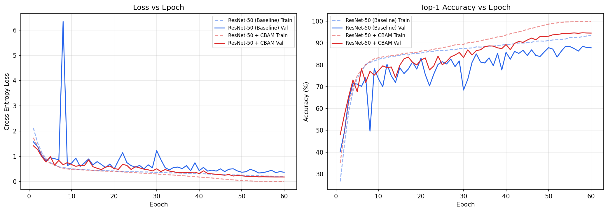

# CBAM-ResNet50 on CIFAR-10

PyTorch implementation of **CBAM: Convolutional Block Attention Module** (Woo et al., ECCV 2018), integrated into a CIFAR-adapted ResNet-50 and evaluated on CIFAR-10.

---

## What is CBAM?

Standard CNNs treat all feature map channels and all spatial positions equally. CBAM adds two lightweight attention modules after each residual block that learn to answer:

1. **Which channels matter?** — Channel Attention Module
2. **Where in the image matters?** — Spatial Attention Module

These are applied sequentially. The channel attention uses both average and max pooling through a shared MLP. The spatial attention concatenates channel-wise pooled maps and passes them through a 7×7 conv. Both produce sigmoid-gated weight maps that are multiplied back into the feature map.

---

## Architecture
```
Input
  │
  ▼
CIFAR Stem: Conv3x3 stride=1 (no maxpool — adapted for 32x32 inputs)
  │
  ▼
Layer 1-4: Bottleneck Residual Blocks
  │
  └── Each block: Conv1x1 → Conv3x3 → Conv1x1 → CBAM → (+identity) → ReLU
  │
  ▼
Global Average Pool → FC(2048 → 10)
```

CBAM is inserted after the final 1×1 conv in each bottleneck block, before the skip connection addition. This is the canonical placement from the paper.

---

## Results

Trained for 60 epochs on CIFAR-10 (50k train / 10k test) with SGD + cosine annealing LR schedule and 5-epoch linear warmup.

| Model | Parameters | Best Val Accuracy |
|---|---|---|
| ResNet-50 Baseline | 23,520,842 | 88.49% |
| ResNet-50 + CBAM | 23,701,578 | 94.65% |
| Gain | +180,736 (+0.77%) | **+6.16%** |

CBAM adds less than 1% parameters while delivering a substantial accuracy gain under this training setup.



---

## Training Setup

| Setting | Value |
|---|---|
| Dataset | CIFAR-10 |
| Epochs | 60 |
| Batch size | 128 |
| Optimizer | SGD, momentum=0.9, weight decay=5e-4 |
| LR schedule | Linear warmup (5 epochs) + Cosine annealing |
| Initial LR | 0.1 |
| Augmentation | RandomCrop(32, pad=4), RandomHorizontalFlip, Normalize |

---

## Project Structure
```
cbam-resnet/
├── modules/
│   └── cbam.py           # Channel and Spatial Attention modules
├── models/
│   ├── resnet.py          # CIFAR-adapted ResNet-50 baseline
│   └── cbam_resnet.py     # ResNet-50 with CBAM blocks
├── utils/
│   └── metrics.py         # AverageMeter, accuracy, checkpoint utils
├── train.py               # Training script with resume support
├── evaluate.py            # Evaluation and plot generation
└── results/
    ├── baseline_history.json
    ├── cbam_history.json
    ├── eval_results.json
    └── training_curves.png
```

---

## Usage

**Train baseline:**
```bash
# set CONFIG['model'] = 'baseline' in train.py
python train.py
```

**Train CBAM model:**
```bash
# set CONFIG['model'] = 'cbam' in train.py
python train.py
```

**Evaluate and generate plots:**
```bash
python evaluate.py
```

---

## Reference

> Woo, S., Park, J., Lee, J. Y., & Kweon, I. S. (2018). CBAM: Convolutional Block Attention Module. *European Conference on Computer Vision (ECCV)*.  
> https://arxiv.org/abs/1807.06521
